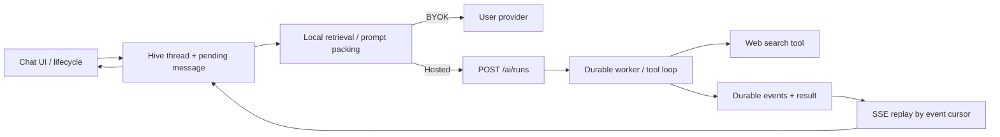

# Agent 全链路审计与整改记录（2026-08-09）

## 结论

当前 Flutter 客户端已对本轮发现的主要数据完整性、恢复、并发与凭据边界问题完成代码整改并补充回归测试；Dart formatter 已解析通过，`git diff --check` 已通过。

但当前仍不满足“可直接发布”的证据标准：

1. 本轮新增 Flutter 测试尚未实际执行，`flutter test` / `flutter analyze` 被本机 Flutter SDK 锁与沙箱权限/审批额度阻断；
2. 生产后端仅完成只读审计，没有在生产脏工作树中修改或部署；
3. 后端 durable run、worker lease、幂等、配额、服务端同步凭据净化仍有 P1；
4. 曾进入 Git 历史的 embedding 凭据必须在供应商侧轮换/吊销，删除当前源码不能使历史凭据失效。

因此当前发布判断为：**客户端整改待测试，后端仍为 release blocker，不可宣称全链路已闭环。**

## 审计范围与证据边界

- Flutter：当前共享工作树的 Chat → RAG → Hosted Agent / BYOK → SSE → Hive 恢复链路；
- 本地持久化：聊天线程、消息、附件、删除墓碑、web cache、sync outbox/shadow/conflict；
- 生产后端：`/opt/memora-backend` 源码、当前 compose API、数据库中 durable run 事件（只读）；
- Harness：focused unit/widget 测试、fake 与生产接线差异、生命周期/并发/崩溃窗口；
- 安全边界：API Key、联网查询、网页内容、引用、配额、日志/历史数据保留。

生产后端无 Git remote，工作树另有未提交迁移和源码改动；任何后端整改都必须先从已确认 commit 建立隔离工作区，不能直接在生产目录生成迁移或覆盖文件。

## 全链路



成功语义不是“收到任意 completed 标记”，而是：

- 同一次创建重放使用同一 attempt key；用户主动重试使用新 attempt key；
- 客户端 cursor 已追到 snapshot high-water；
- 收到 authoritative 非空 full answer，或明确 failed/cancelled；
- answer、sources、terminal status 与最后 cursor 一起持久化；
- 网络/本地写入失败不能伪装成服务端终态。

## 客户端已整改（代码完成，测试执行待完成）

### 1. Hosted Agent / RAG 接线

- 生产实际注入 `agentRunStream`，能力判断现同时识别 durable 与旧 stream；避免先调用 `/ai/web-search`、再让 Agent 内部搜索造成双搜索、双配额与 `[wN]` 编号冲突；
- Hosted Agent 来源进入统一引用映射；
- Agent 成功不再回退读取另一个 AI service 的历史 `lastError`；
- hosted service 的当前错误、sources、cursor 只归属于本次 run。

### 2. Durable SSE 与进程恢复

- SSE JSON 成功解析后才提交 event cursor；截断 `data:` 不会跳过事件；
- snapshot 401 支持一次 session refresh；HTTP/timeout/重连失败区分 retryable 与 terminal；
- `run.completed` 不再被当成 answer 终态，继续等待 `run.result`；
- resume 使用消息已持久化的 `aiRunEventSeq`，不能用服务端最新 cursor 跳过本地缺口；
- 所有 SSE 成功/失败终结前必须追平 snapshot high-water；
- queued/running/unknown + `[DONE]` 或 clean EOF 不能被标 completed；
- empty/whitespace full answer 与 empty `run.result` 不覆盖已持久化 partial；
- authoritative full answer 替换 prefix，delta 追加，failed/cancelled 保留 partial 与 cursor；
- 冷启动 provider 延迟、live create-run 前窗口、生命周期恢复均通过调度 latch 串行；
- poison run 的 retryable 异常逐消息隔离，不再饿死同批其他 pending；三次自动退避耗尽后保留可恢复记录，但不永久锁死输入。

### 3. 幂等与聊天持久化并发

- pending message 持久化独立 `aiRunRequestKey`；显式用户重试生成新 UUID，传输重放复用同一 attempt；
- live 与 resume 不再同时操作同一个有实例状态的 HostedAgentService；
- Hive thread mutation 串行化；message activity 只原子更新 preview/time，不覆盖并发 rename/pin；
- selection revision 防止 A→B 反序恢复和 same-ID ABA 回跳；
- 删除后立即从可见状态移除，不在附件 await 窗口复活线程；
- writes 对 missing/tombstoned thread 有前后 FK 检查。

### 4. 删除隐私与附件所有权

- 跨 box 删除使用 durable tombstone：先写删除 commit point，再删 thread/messages，重启幂等续删；
- public reads 隐藏 tombstoned 数据，writes 禁止复活；
- tombstone 带 revision，文件清理完成后按 expected revision ack；
- malformed/未来 schema 记录被 quarantine，保留 opaque 字段，不进行破坏性降级或错误 ack；
- 即使附件 MIME/名称/hash 损坏，独立 ownership ID 仍通过 Hive field 21 持久化并用于清理；
- `canAcknowledge=false` 时仍删除已验证的附件 ID，但保留 tombstone 供未来恢复；
- 单条坏墓碑不阻断整批初始化清理。

### 5. Web 搜索边界

- 结果最多解析 10 条；title/content 按 Unicode rune 限长；score 只保留 finite 0..1；
- URL 仅允许 http/https，限制长度，拒绝 credentials、localhost、`.local`、`.internal`、IPv4/IPv6 与多种数字 IP 表示；
- web cache 按 hosted account / BYOK namespace 隔离；旧无 namespace cache 一次性清理；
- Hosted Agent 接管搜索时客户端不再预搜。

### 6. BYOK 与账号同步

- 五个 provider Key 仅保存在设备设置；`toSyncJson()` 使用无密钥 schema 2，本地完整备份仍保留 Key；
- app_settings 在 mutation、outbox、shadow、conflict、push 最终出口、pull/conflict 入口统一递归净化；
- 远端 settings upsert 无条件保留本机五个 Key，远端 settings tombstone 不清空本机凭据；
- outbox 使用串行 `claimPending()` 原子冻结 id/payload；claim 后同实体新修改必须使用新 ID；
- batch 后项失败只 CAS 标记仍属于该 claim 的记录，不复活已 ack 记录、不覆盖 conflict；
- attempted legacy 净化先持久 replacement intent/new record，再删旧 record，且并发 normalization 只产生一个 replacement；
- legacy remote current 若仍含 Key，会强制生成一次 clean rebased scrub event；服务端历史/日志/备份仍必须单独迁移。

### 7. 凭据与文档

- 客户端不再内置 embedding Key；未配置 BYOK embedding 时降级到本地关键词检索；
- README、OVERVIEW、PRD、ROADMAP 与服务端同步契约已改为真实边界：账号同步不是 E2EE，Hosted Agent 经后端，完整 JSON 备份包含 Key 且属于敏感文件。

## 生产后端仍未整改的 P1

### A. Durable 事件与事务

生产数据库中抽查到的 7/7 completed runs 均为：

`queued → running → started → model.started → run.completed → run.result`

这证明 `run.completed` 早于 answer/result 不是理论风险。客户端已兼容历史顺序，但后端仍应：

- runtime 不发最终 `run.completed`；
- worker 在同一事务内写 answer/status、`run.result`、最后 `run.completed`；
- failure/cancel 同样事务化；
- event append 与 terminal row update 不能分离提交。

### B. 幂等与配额事务

- 同一 idempotency key 对 completed/failed/cancelled 永远返回旧 run，用户主动再生成若误复用 key 不会新建；
- 后端未保存 canonical request hash，同 key 不同请求不能返回 409；
- create run 与 daily quota 不是一个事务，唯一键冲突/响应丢失可能错误扣额；
- durable execute 没有持久化/传递实际 plan，Agent web tool 可能按 FREE 扣额；
- 分钟 limiter 是单进程 Map，多副本不共享。

### C. Worker 所有权

- startup 会把 RUNNING 重置 QUEUED，没有 lease/owner/heartbeat/fencing；滚动发布或多实例可重复执行、重复计费；
- pending 恢复只取前 100 条且无持续分页；
- 无 cancel endpoint；
- 没有 attempt_count / next_attempt_at 的持久退避与死信策略。

### D. Provider、工具与数据外发

- `findModelByKind` 不检查 provider.enabled，禁用 provider 仍可直接调用；
- 一步可并行多个 tool calls，只有 step 上限，没有每步 tool 数/参数总量/总搜索预算；
- 网页文本虽被 prompt 标记为 untrusted，但没有程序化 query egress/DLP gate；prompt injection 可能诱导模型把会话或个人记忆加工成 Tavily query；
- 搜索结果缺少服务端 title/url/content 总字节上限、URL 私网/credentials 防御与 relevance threshold；
- 只要 answer 含一个合法 `[wN]` 就不会修复整段引用，伪造的 `[w999]` 可残留在正文。

### E. 凭据历史、保留与迁移

- 服务端必须在 sync push 入口强制剔除五个 Key，不能只信任新客户端；
- 必须清理 current entities、event history、conflicts、audit/log copies 与备份，并对旧客户端做版本门禁；
- cleanup 代码存在但生产没有 cron/systemd/compose 调度，prompts/results/events 会无限保留；
- 当前后端没有 EMBEDDING provider kind 或 `/ai/embeddings` 路由，不能把客户端 embedding BYOK 直接切到 hosted。

### F. Schema 与发布流程

- Prisma schema 仍把 provider `name` 写成单列 unique，生产数据库实际是 `(name, kind)` unique；任何新 migration 前必须先校准 drift；
- Dockerfile 只 build 不 test，`/ai/runs` 没有路由测试；现有 thinking test 与实现存在失配；
- 生产网络仍有遗留 one-off probe container，应在确认用途后按运维流程清理。

## 后端建议拆分批次

### Batch A：无 schema 止血

1. 修正 terminal event 顺序与事务；
2. 传递真实 plan/tier 到 runtime/tool quota；
3. `findModelByKind` 强制 enabled；
4. 限制每步 tool 数、参数大小、总 web budget；
5. 增加服务端 URL/content bounds 与 query egress 检查。

### Batch B：幂等与 quota

1. 先校准 Prisma provider unique drift；
2. `ai_runs` 增加 `request_hash`；
3. 对 normalized request 做 canonical SHA-256；
4. 同 user/key 同 hash replay，不同 hash 返回 409；
5. create + quota 使用同一事务，唯一冲突回滚并查询 replay。

### Batch C：worker lease / cancel / cleanup

1. 增加 worker_id、lease_until、attempt_count、next_attempt_at；
2. 使用 `SKIP LOCKED` 原子 claim、heartbeat 与 owner fencing；
3. 删除 startup 全量 RUNNING→QUEUED；
4. 持续分页扫描，不限一次 100；
5. 增加 cancel endpoint 与实际 cleanup scheduler。

### Batch D：sync 凭据净化与历史迁移

1. push 入口递归净化 app_settings；
2. 事务化扫描 current/history/conflict/audit；
3. 对旧备份制定轮换/到期删除；
4. pull/bootstrap 永不返回 Key；
5. 旧客户端版本门禁；
6. 用不含凭据值的计数证明迁移完成。

## 验证门槛

### Flutter（尚未执行）

至少运行：

```text
flutter analyze --no-pub
flutter test --no-pub \
  test/hosted_agent_service_test.dart \
  test/chat_background_recovery_test.dart \
  test/chat_repository_test.dart \
  test/chat_sessions_provider_test.dart \
  test/rag_web_search_test.dart \
  test/web_search_test.dart \
  test/settings_sync_serialization_test.dart \
  test/sync_outbox_service_test.dart \
  test/sync_apply_service_test.dart \
  test/sync_conflict_service_test.dart \
  test/sync_service_test.dart \
  test/security_test.dart \
  test/backup_test.dart
```

### 后端

- `/ai/runs` create/get/events 的 auth、idempotency hash、cursor replay、terminal ordering、quota transaction 测试；
- 两 worker 并发、lease 过期、heartbeat、owner fencing、滚动发布恢复测试；
- tool amplification、prompt injection query、SSRF-like URL、oversize response 测试；
- sync legacy Key push、历史迁移、bootstrap/pull、旧版本门禁测试。

### 真实验收

- Android 真机：发送、后台、杀进程、断网/恢复、旧 partial、引用、删除带附件线程；
- 两设备：不同本机 Key、settings sync、冲突、退出/换账号、旧客户端拒绝；
- 后端 canary：事件严格 `result → completed`，重复请求不重复计费，多 worker 不重复执行；
- 数据库/日志/备份只做字段存在性与计数验证，禁止把真实凭据打印到报告。

